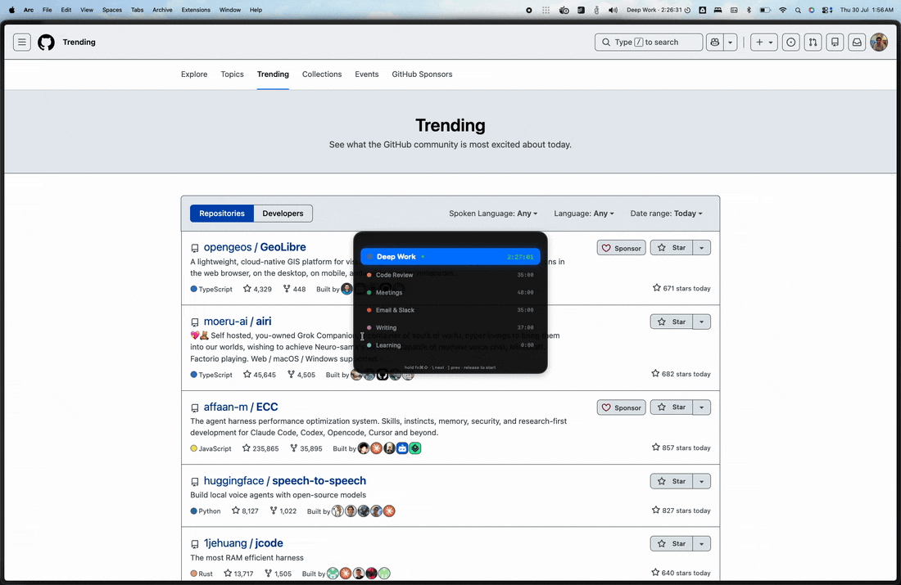
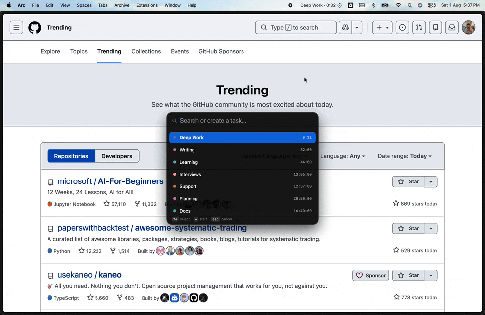
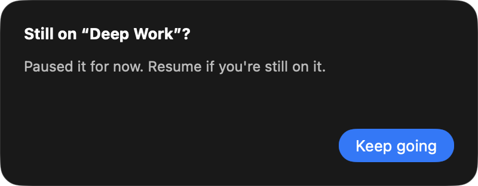
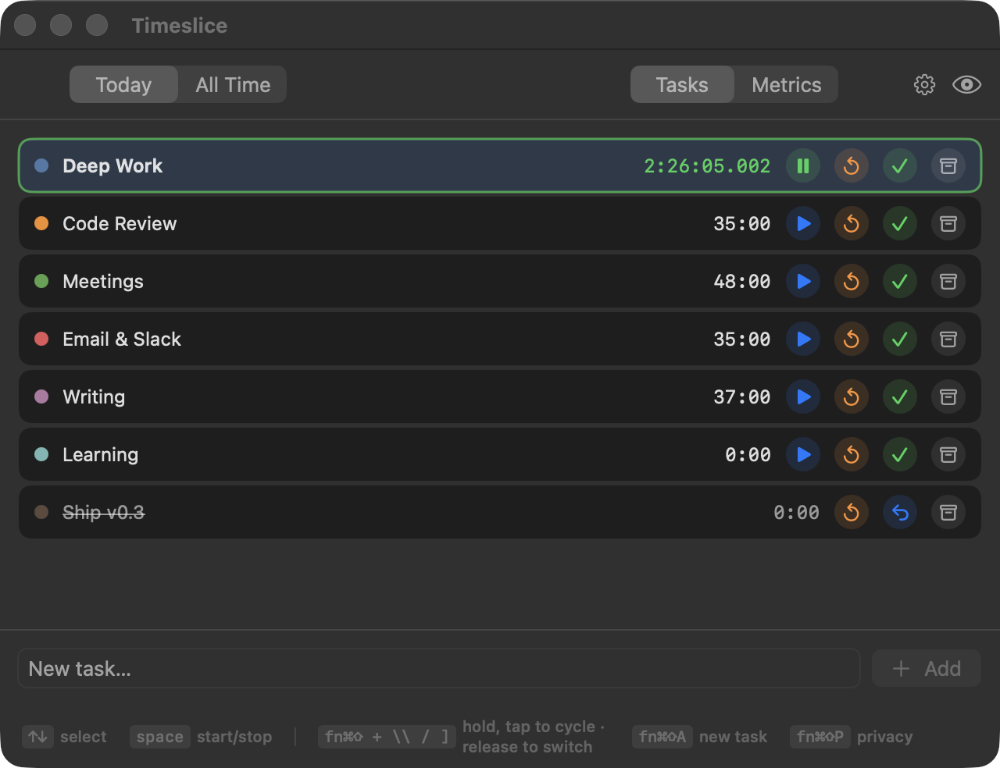
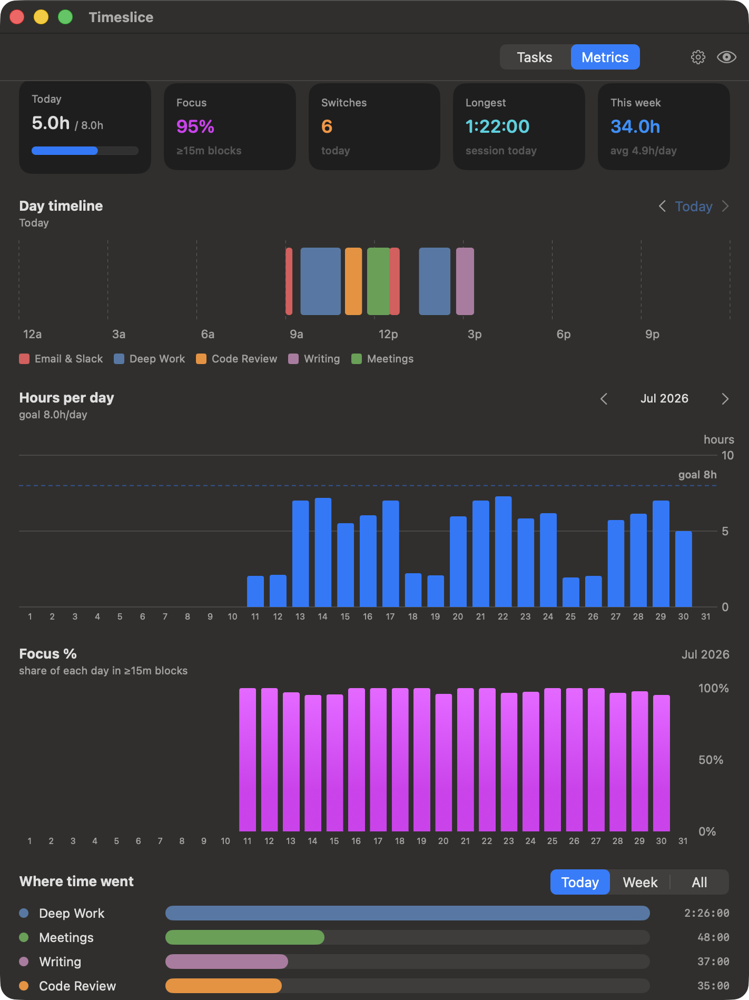

# Timeslice

**A time tracker for fast, restless, multitasking brains.**

If you bounce between things all day — the way a lot of ADHD folks do — you're great at *doing*
the work but terrible at *seeing where the hours went*. Most time trackers make that worse: they
demand you stop, find a window, click into a form, pick a project. By then you've lost the thread.

Timeslice removes almost all of that friction. It lives in your menu bar, and you drive it from
your keyboard without ever leaving what you're doing:

- **Switch tasks** — hold **Fn + Command (⌘) + Shift (⇧)** and tap `\` / `]` to flick through
  your tasks like ⌘-Tab, let go, and boom — the old one's paused, the new one's timing.
- **New task on the fly** — **Fn + Command (⌘) + Shift (⇧) + A**, type a name, hit Return, and
  boom — it's created and already tracking.

That's the whole idea: a near-zero-friction layer that quietly records where your time actually
goes, so at the end of the day you can *see* it — without ever having babysat a stopwatch.

It also covers the ways restless tracking goes wrong: forget to stop and it **auto-pauses** and
nudges you; close the laptop and it pauses on sleep; wander off mid-task and a quick tap puts you
back. Local-first, offline, no account, no server — just your time, on your Mac.

## See it

**Switch tasks with the revolver** — hold **Fn + ⌘ + ⇧**, tap `\`/`]` to cycle, release to
switch; start/stop with a tap. Works over whatever app you're in:



**Add a task on the fly** — **Fn + ⌘ + ⇧ + A**, type, hit Return, and it's already tracking:



**Forgot to stop? It nudges you.**



**The task list** — one keypress to switch, the running task ticking live:



**Where the day went** — timeline, hours-vs-goal, focus %, per-task breakdown:



## Features

- **Menu bar**: live timer + current task; turns into an orange pill whenever it's paused.
- **Revolver switcher** (**Fn + ⌘ + ⇧** + `\`/`]`): flick between tasks from any app, release to switch.
- **Quick-add** (**Fn + ⌘ + ⇧ + A**): new task + start timing in two keypresses.
- **Auto-pause**: runs too long → pauses and asks "still on this?"; sleeping pauses too, waking
  offers to resume — forgotten timers never inflate your time.
- **Metrics**: day timeline, hours-per-day vs a goal, focus %, and where your time went.
- **Screen-share safe**: windows blank out on capture; a privacy toggle hides the menu-bar name.

## Global hotkeys

Keys: **Fn** (the globe/fn key, bottom-left) · **⌘ Command** · **⇧ Shift**. Hold all three
together, then press the last key. These work from any app:

| Hold | then press | What it does |
|---|---|---|
| Fn + ⌘ + ⇧ | `\` (next) or `]` (prev) | Cycle the task switcher; **release the three keys** to switch to the highlighted task. A quick press-and-release (without cycling) just pauses the current task. |
| Fn + ⌘ + ⇧ | `A` | Quick-add a task and start timing it. |
| Fn + ⌘ + ⇧ | `P` | Toggle menu-bar privacy. |

Inside the app window/popover (no modifiers): **↑ / ↓** to select a task, **Space** to start/stop.

These need **Accessibility permission** (macOS gates the Fn key + release detection behind it).
Grant it once at **System Settings → Privacy & Security → Accessibility**. Everything else works
without it.

## Install

Requires macOS 14+ and the Swift toolchain (Xcode Command Line Tools is enough — no full Xcode).

```bash
./scripts/install.sh
```

Builds `Timeslice.app`, installs it to `/Applications`, and launches it — no prompts. Then enable
it under **System Settings → Privacy & Security → Accessibility** for the global hotkeys. Re-run
the script anytime to update.

> Dev: `swift build` / `swift run TimesliceApp` for iteration; `swift run TimesliceSelfTest` for
> the core-logic checks. Data lives at `~/Library/Application Support/Timeslice/timeslice.db`.
